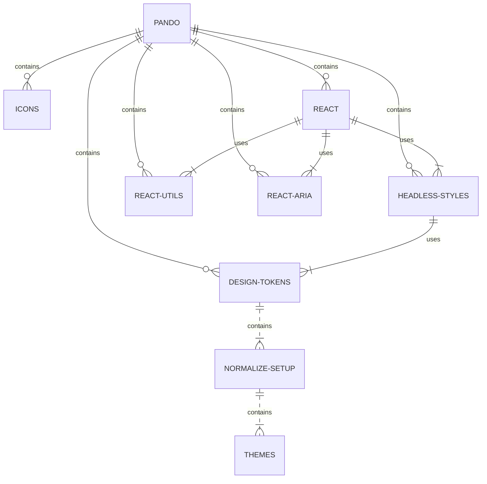

# React Aria

A library of aria helpers for React components.

## What role does this package play in Pando?



This package utilizes the latest version of React to deliver flexible aria helpers for components.

### React General Function

The react-aria package works cohesively with the other libraries when combined with them. It's true purpose is to provide a11y to any component from the react package.

## Install

This project uses bun so there are no setup commands needed. If you get any errors, you may need to run an initial `bun install` or ensure you are using Node >= 18.

## Development

We utilize a Vite TS/React sandbox to help keep security issues, complexity, and dependency size down which is a common problem when using a tool like Storybook.

From the **root directory of the project**, run:

```bash
bun run start:sandbox
```

## Testing

To run your unit tests, make sure you are in the **project root directory** not this workspace - and run:

```bash
bun test tests/react-aria
```

## Contribution

If you plan on contributing to this project, please take time to read our [CONTRIBUTING.md](https://github.com/pluralsight/pando/blob/main/CONTRIBUTING.md). Pull requests that do not adhere to the requirements in this doc will automatically be flagged and closed.
